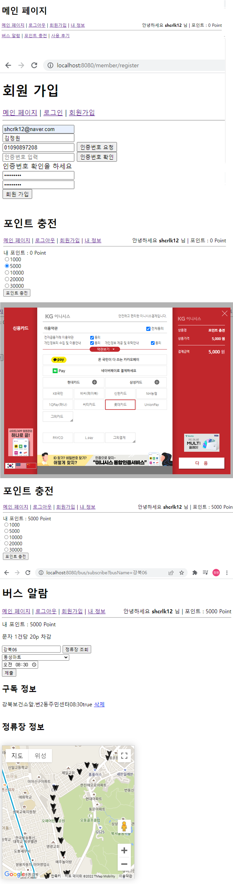

# 나만의 버스 도착 알람
## 개요
출근시 매번 버스 도착 정보를 확인하기 위해 어플에 들어가 확인하는 과정이 힘들어 개발을 진행하게 되었음
Backend 지식을 습득하는것을 주 목적으로 하였기 때문에, Frontend는 미흡함

## 기술 스택
### Backend
* Spring boot, Mysql, Spring security, JPA
### Frontend
* Timeleaf, html, css, javascript

## 구현 내용
### 일반 유저
* 로그인, 로그아웃
* 회원 가입
    * 회원 가입 시, 핸드폰으로 인증 번호를 전송하여 인증 번호 확인 필요
* 포인트 충전 기능
    * I'mport에서 제공하는 신용카드 결제기능을 이용하여 구현
* 버스 정류장 및 도착정보 조회
    * 공공데이터포털에서 제공하는 Open API와 Google Map을 이용하여 구현
* SMS Service
    * Nurigo에서 제공하는 SMS 서비스를 이용하여 구현

## Page

